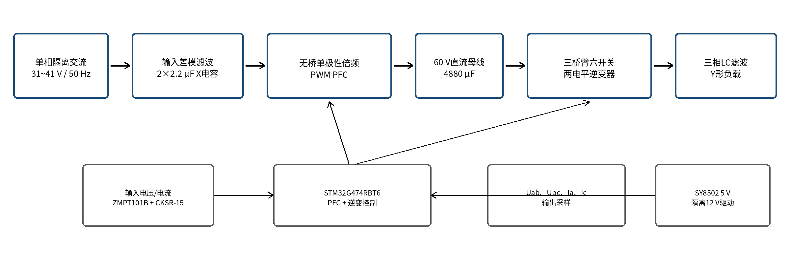
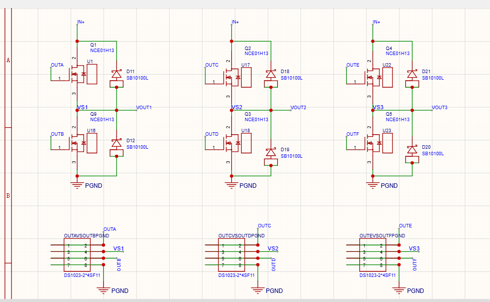
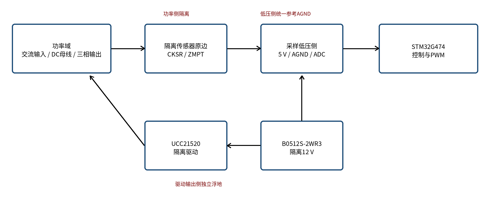
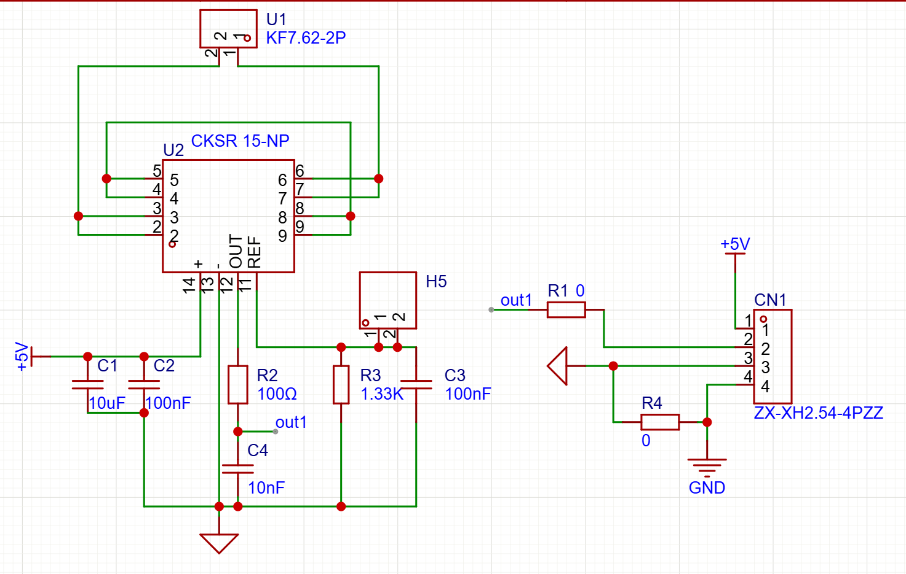
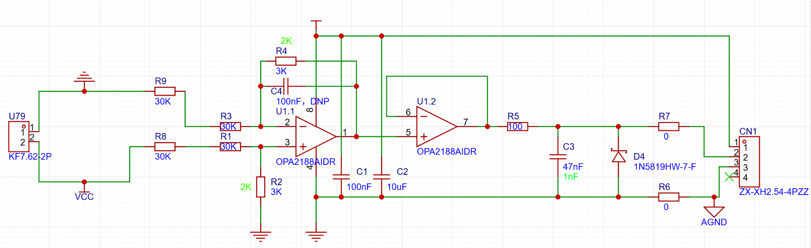
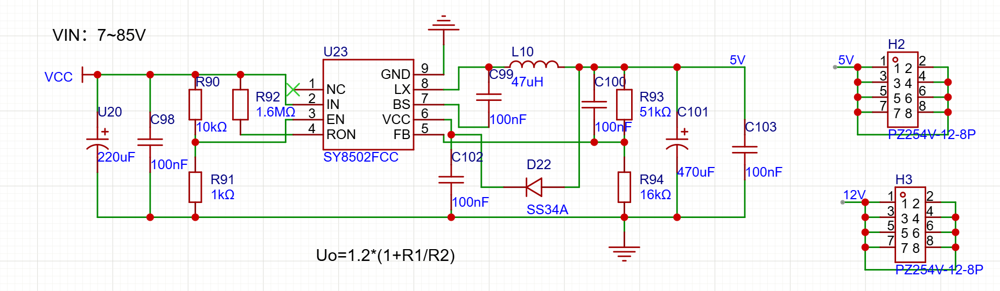
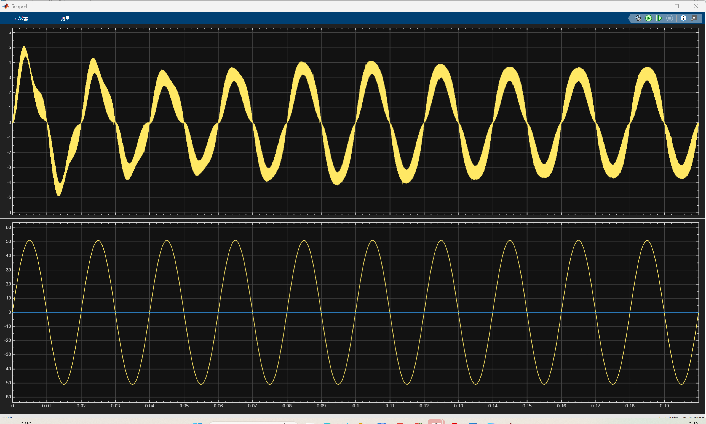
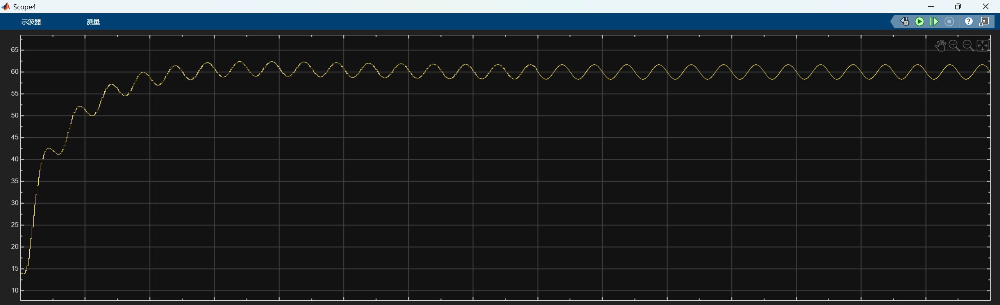
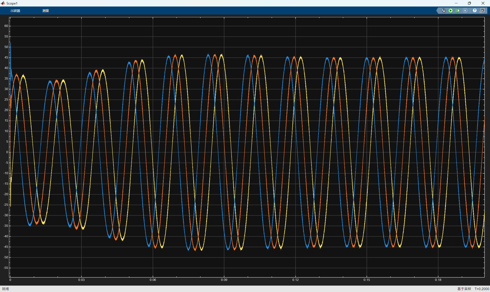

# 单相功率因数校正与三相逆变系统

本项目基于 STM32G474 微控制器，实现“单相交流输入、直流母线稳压、三相交流输出”的两级电能变换系统。前级采用有源功率因数校正，使输入电流跟随输入电压并稳定直流母线；后级采用三相全桥逆变，通过电压、电流双闭环和空间矢量脉宽调制，输出对称的三相交流电压。

项目同时包含控制程序和仿真模型：

- 控制程序位于 `User` 目录；
- 仿真模型为 `仿真/pfc＋三相逆变仿真.slx`；
- 工程配置文件为 `threenibian.ioc`；
- 控制芯片为 STM32G474；
- 采样频率为 20 千赫，控制频率为 10 千赫。

## 一、系统总体结构

```text
单相交流输入
      │
      ▼
电压、电流采样 ──► 功率因数校正控制
      │                    │
      ▼                    ▼
有源整流全桥 ──────► 直流母线（目标 60 伏）
                           │
                           ▼
              三相全桥逆变与空间矢量调制
                           │
                           ▼
                    输出滤波与负载
                           │
                           ▼
              30/60 赫兹三相交流输出
```

系统分为前后两级。前级读取输入电压、输入电流和母线电压，完成升压、稳压和输入电流整形；后级读取两路线电压与两相电流，通过三相三线制关系重构其余电压、电流，再完成闭环逆变控制。

## 二、主要设计指标

| 项目 | 设定值或说明 |
| :-- | :-- |
| 输入形式 | 单相交流输入 |
| 输入基波频率 | 50 赫兹 |
| 输入额定有效值 | 程序标称值为 35 伏，允许有效范围为 28～45 伏 |
| 直流母线目标 | 60 伏 |
| 三相输出线电压有效值 | 约 32 伏 |
| 三相输出频率 | 30 赫兹或 60 赫兹，可切换；上电默认 60 赫兹 |
| 采样频率 | 20 千赫 |
| 控制频率 | 10 千赫 |
| 功率因数校正输入电流给定上限 | 7.5 安有效值 |
| 逆变相电流参考上限 | 6 安 |
| 逆变硬件过流阈值 | 8 安 |
| 功率因数校正硬件过流阈值 | 13 安 |
| 直流母线硬件过压阈值 | 85 伏 |

> 上表给出的是当前控制程序中的目标值和保护阈值。效率、总谐波畸变率等指标不能仅由示波器截图准确得到，因此本文不作无依据的数值声明。

## 三、前级功率因数校正算法

前级采用“母线电压外环、输入电流内环”的双闭环结构，并加入输入电压前馈。

### 1. 母线电压外环

母线电压目标为 60 伏。系统启动后并不直接给定满目标，而是从当前实测母线电压开始，以设定斜率逐步增加参考值，从而减小启动冲击。

母线电压误差为：

```text
母线电压误差 = 母线参考电压 - 母线反馈电压
```

比例积分调节器根据该误差产生输入电流有效值指令。输出带有限幅和积分限幅，防止启动或突加负载时积分量持续累积。

### 2. 输入电压有效值与功率前馈

程序以一个工频周期的数据计算输入电压有效值，并对结果滤波。有效值在 28～45 伏范围内才会被控制器接受；首个计算窗口完成前暂用 35 伏标称值。

为减小输入电压变化对输出功率和母线电压的影响，控制器使用下式形成前馈增益：

```text
输入电压前馈增益 = 35 伏 / 实测输入电压有效值
```

前馈增益限制在 0.70～1.30 之间。输入电压降低时适当提高电流指令，输入电压升高时适当降低电流指令，使输入功率大致保持稳定。

### 3. 输入电流内环

瞬时电流参考由电流有效值指令与归一化输入电压相乘得到：

```text
瞬时电流参考 = 电流有效值指令 ×（输入瞬时电压 / 输入电压有效值）
```

因此电流参考与输入电压同频、同相。电流内环采用有限带宽比例谐振调节器，对 50 赫兹基波实现较高增益，降低稳态跟踪误差。控制器输出与输入电压前馈共同形成全桥交流侧电压指令：

```text
全桥电压指令 = 输入瞬时电压 - 电流调节器修正量
调制度 = 全桥电压指令 / 直流母线电压
```

调制度经过限幅后送入前级脉宽调制模块。前级采用两桥臂单极性倍频调制，正、负半周分别安排对应桥臂的开关状态；比较值通过预装载寄存器在统一更新边界生效，以避免同一周期内出现不一致脉冲。

### 4. 调试模式

前级控制器保留三种工作模式，便于逐级调试：

| 模式 | 用途 |
| :-- | :-- |
| 固定占空比模式 | 不运行电压环和电流环，只检查驱动与功率级开关波形 |
| 单电流环模式 | 关闭母线电压外环，以手动电流有效值给定调试电流环 |
| 完整闭环模式 | 同时运行母线电压外环、电流内环和输入电压前馈 |

## 四、三相逆变算法

后级采用“线电压有效值慢速校正 + 瞬时电压外环 + 电流内环 + 空间矢量脉宽调制”的控制结构。

### 1. 三相参考电压生成

控制器按照所选的 30 赫兹或 60 赫兹频率累加相角，生成相差 120° 的三相正弦参考。线电压目标约为 32 伏有效值，其中 30 赫兹和 60 赫兹分别使用 31.95 伏和 32.06 伏的内部标定值。

输出电压参考同样采用软启动，从 0 伏以每秒 16 伏有效值的速度上升至目标值。程序还对三路线电压计算有效值和不平衡量，并用慢速比例积分环对公共幅值进行小范围修正。

### 2. 电压、电流双闭环

逆变侧实际采样两路线电压和两相电流。对三相三线制系统，可利用下式重构三相量：

```text
Va = (2Uab + Ubc) / 3
Vb = (-Uab + Ubc) / 3
Vc = -(Uab + 2Ubc) / 3

Ib = -Ia - Ic
```

电压外环采用比例谐振调节器，根据参考相电压与反馈相电压的误差生成三相电流参考。电流参考统一限幅到 6 安以内，同时保持三相比例和 `Ia + Ib + Ic = 0` 的约束。

电流内环也采用比例谐振调节器，根据参考电流与反馈电流的误差生成电压修正量。最终相电压指令由正弦参考前馈和电流环修正量相加得到，再根据直流母线电压换算为三相调制度。

当输出频率在 30 赫兹和 60 赫兹之间切换时，程序会先停止逆变输出，重新计算四个比例谐振调节器的谐振系数，清除历史状态，然后再启动输出，避免带载直接改变控制参数。

### 3. 空间矢量脉宽调制

空间矢量调制模块首先求三相调制度的最大值和最小值，再注入公共零序分量：

```text
零序分量 = -(三相最大值 + 三相最小值) / 2
```

这样可提高直流母线电压利用率。若三相调制度跨度超过允许范围，程序会先按相同比例缩放三相指令，再计算三相占空比，从而保持线电压比例不变。三相桥臂采用中心对齐互补脉冲，并设置死区及比较值边界，降低上下桥臂直通风险。

## 五、采样、控制与启动流程

采样频率为 20 千赫，控制频率为 10 千赫。模数转换由高分辨率定时器同步触发，采样结果通过直接存储器访问循环搬运。控制计算按每两个采样点执行一次，以兼顾采样分辨率与处理器运算负担。

上电启动顺序如下：

1. 强制关闭前级四路和逆变六路功率输出；
2. 启动定时器、模数转换和数据搬运，仅进行安全采样；
3. 完成逆变两路电压、两路电流的零点校准；
4. 配置前级与逆变侧模拟看门狗阈值；
5. 初始化功率因数校正控制器并建立直流母线；
6. 当母线电压达到 55 伏后，允许三相逆变投入；
7. 运行期间若母线电压低于 45 伏，立即停止逆变输出。

## 六、保护设计

系统同时使用硬件快速关断和软件状态锁存：

- 前级输入电流超过 13 安时关闭功率因数校正输出；
- 直流母线超过 85 伏时关闭功率因数校正输出；
- 任一逆变采样相电流超过 8 安时关闭三相逆变输出；
- 直流母线低于 45 伏时停止逆变，达到 55 伏后才允许重新投入；
- 母线电压过低时停止电流调节器历史递推，防止电压恢复后产生突变控制量；
- 启动、停机和频率切换都会清除调节器历史状态，并从安全占空比开始。

故障由中断快速关闭硬件输出，并在软件中锁存故障状态。故障未清除前，主循环不会再次使能功率输出。

## 七、硬件设计

硬件采用“无桥功率因数校正整流、60 伏直流母线、三相两电平逆变、三相滤波”的两级结构，由 STM32G474RBT6 统一完成采样、控制和脉宽调制。系统功率等级按 32 伏线电压、2 安线电流设计，三相负载采用星形连接，额定输出有功功率约为 111 瓦。



### 1. 前级功率因数校正主电路

前级由 4 只 NCE01H13 功率场效应管组成四开关无桥整流器，采用单极性倍频脉宽调制。无桥结构省去了传统整流桥中串联导通的两只二极管，可降低低压、大电流工作时的导通损耗。

交流输入两线分别串联 215 微亨电感，电流回路等效电感约为 430 微亨。输入端并联 2 只 2.2 微法安规电容，总容量为 4.4 微法，用于抑制差模开关电流。每个功率桥臂附近设置 10 微法与 100 纳法陶瓷退耦电容，以缩短高频换流回路。

### 2. 直流母线

直流母线目标电压为 60 伏，由 4 只 1000 微法、100 伏电解电容和 4 只 220 微法、100 伏电解电容并联，总容量为 4880 微法。多只电容并联可以降低等效串联电阻，并分担单相输入产生的 100 赫兹纹波电流。

按约 117 瓦母线功率估算，理论母线纹波峰峰值约为 1.27 伏。实际纹波还会受到负载、母线电容等效串联电阻及电压环带宽影响，因此需要结合母线波形实测确认。

### 3. 三相逆变及输出滤波

后级由 6 只 NCE01H13 功率场效应管组成三桥臂两电平电压型逆变器。60 伏母线使用连续空间矢量调制时，线性调制区最大基波线电压有效值约为 42.4 伏，因此输出 32 伏线电压仍具有调制裕量。



输出每相串联一只标称 470 微亨、实测约 450 微亨的铁硅铝电感；3 只 3.3 微法、400 伏薄膜电容采用三角形连接。折算为星形连接时，每相等效电容为 9.9 微法，理想谐振频率约为 2.38 千赫，处于输出基波频率与开关频率之间，可以滤除高频开关分量。

当前滤波器没有设置独立阻尼支路，硬件调试时应重点检查轻载谐振、满载温升和电感饱和情况。

### 4. 栅极驱动与隔离电源

前级使用 2 块、逆变级使用 3 块 UCC21520 双通道隔离栅极驱动板，共驱动 10 只功率场效应管。每块驱动板使用 2 只 B0512S-2WR3 隔离电源模块，为上、下桥臂分别提供相互隔离的 12 伏驱动电源。

每只功率场效应管的栅极串联 10 欧电阻，并设置 10 千欧栅源下拉电阻。驱动器和定时器均配置死区，最终有效死区应以实际栅极波形为准，避免简单叠加软件与驱动器的标称死区。



### 5. 电压与电流采样

交流输入电压和逆变输出线电压采用 ZMPT101B 隔离电压传感器，并使用 OPA2188 完成偏置、放大和缓冲。输入电流及逆变 A、C 两相电流采用 CKSR-15-NP 闭环电流传感器；传感器原边使用 2 匝连接，灵敏度约为 83.34 毫伏每安。



电流传感器输出端使用 100 欧电阻和 10 纳法电容构成一阶低通滤波器，截止频率约为 159 千赫，用于抑制高频尖峰，同时避免对控制带宽造成明显影响。传感器参考网络建立约 1.65 伏中点偏置，使模数转换器可以测量正、负交流电流。

直流母线采用 OPA2188 差分衰减和电压跟随器采样。输入网络与反馈网络形成约 1/30 的衰减比例，60 伏母线对应约 2 伏模数转换输入，3.3 伏满量程理论上对应约 99 伏母线。输出端的阻容滤波和肖特基钳位用于抑制瞬态并保护模数转换器。



### 6. 辅助电源

直流母线通过 SY8502FCC 降压电路产生约 5.03 伏辅助电源，反馈电阻为 51 千欧和 16 千欧。5 伏电源为 STM32G474RBT6、采样低压侧和隔离驱动板输入侧供电；10 只 B0512S-2WR3 再为 5 块驱动板提供隔离的 12 伏输出侧电源。



### 7. 接地与布线原则

- 桥臂功率回路、母线本地退耦和驱动回路应尽量短且紧凑；
- 电压、电流采样线应远离桥臂开关节点和栅极驱动线；
- 隔离传感器低压侧统一参考模拟地，并采用单点汇聚；
- 各隔离驱动输出侧保持独立浮地，不与控制地直接连接；
- 母线差分采样属于控制域与功率地之间的参考路径，应避免额外多点连接形成地环路；
- 母线、三相输出、10 路脉宽调制信号和故障信号均应预留清晰测试点。

### 8. 主要器件与参数

| 模块 | 器件或参数 | 数量或说明 |
| :-- | :-- | :-- |
| 主控 | STM32G474RBT6 | 1 只 |
| 功率开关 | NCE01H13 | 10 只，前级 4 只、逆变 6 只 |
| 隔离驱动 | UCC21520 | 5 只双通道驱动器 |
| 隔离电源 | B0512S-2WR3 | 10 只，输出 12 伏 |
| 电压采样 | ZMPT101B、OPA2188 | 输入及两路输出线电压 |
| 电流采样 | CKSR-15-NP | 输入、A 相和 C 相共 3 只 |
| 前级电感 | 215 微亨 | 2 只，回路等效约 430 微亨 |
| 输出电感 | 标称 470 微亨 | 3 只，实测约 450 微亨 |
| 输入安规电容 | 2.2 微法 | 2 只，总容量 4.4 微法 |
| 母线电容 | 1000 微法×4、220 微法×4，耐压 100 伏 | 总容量 4880 微法 |
| 输出滤波电容 | 3.3 微法、400 伏薄膜电容 | 3 只，三角形连接 |
| 5 伏辅助电源 | SY8502FCC、SS34A | 母线降压供电 |

## 八、仿真波形与结果分析

以下图片为本项目仿真示波器截图。图中数值采用坐标轴目测，只用于说明波形趋势；精确有效值、相位差、谐波含量和效率应使用仿真数据记录或专用测量模块计算。

### 1. 输入电压与输入电流



上图上半部分为输入电流，下半部分为输入电压。输入电压呈稳定正弦波，峰值约为 50 伏，频率约为 50 赫兹。输入电流启动阶段峰值约为 5 安，随后逐步进入稳定状态；稳态峰值约为 3.5～4 安。

稳态输入电流与输入电压基本同频、同相，说明电流内环能够使电流跟随电压参考，前级具备功率因数校正效果。电流曲线仍带有一定高频开关纹波，实际系统中可通过输入电感、采样滤波及调节器参数继续优化。

### 2. 直流母线电压



上图为裁剪后的直流母线电压波形。母线由约 14 伏逐渐升高，在约 0.06 秒后稳定于 60 伏附近，说明电压外环可以建立并维持设定母线电压。稳态波形在约 58～62 伏之间周期性波动，中心值约为 60 伏。

该低频纹波主要来自单相输入功率的二倍频脉动，是单相功率因数校正系统的典型现象。程序对母线采样加入 100 赫兹陷波和低通处理，避免电压外环直接追随该纹波而使输入电流发生明显畸变。

### 3. 三相逆变输出电压



上图为三相逆变输出的三路线电压。启动初期幅值逐渐增加，约 0.07 秒后进入稳态，体现了输出电压软启动过程。稳态三相波形幅值接近，峰值约为 45 伏，对应正弦线电压有效值约为 32 伏；三相相位依次错开约 120°，波形整体对称。

按该截图横轴估算，0.2 秒内约有 12 个周期，对应输出频率约为 60 赫兹，与程序的默认输出档位一致。该波形说明三相逆变的相序、幅值和频率均达到预期。正式验收时还应补充保存 30 赫兹工况的波形及频率测量结果。

## 九、程序目录说明

| 路径 | 作用 |
| :-- | :-- |
| `User/pfc_adc` | 前级输入电压、输入电流和母线电压采样，有效值、陷波及低通处理 |
| `User/pfc_adc_watchdog` | 前级输入过流、母线过压检测与故障锁存 |
| `User/pfc_control` | 母线电压外环、输入电流内环和输入电压前馈 |
| `User/pfc_pwm` | 前级全桥单极性倍频脉宽调制与安全输出控制 |
| `User/pfc_app` | 前级校准、初始化、启动、停机和故障状态管理 |
| `User/inverter_adc` | 逆变侧两路线电压、两相电流采样和零点校准 |
| `User/inverter_adc_watchdog` | 逆变侧硬件过流保护 |
| `User/inverter_control` | 三相参考生成、电压电流双环、有效值校正和频率切换 |
| `User/inverter_svpwm` | 三相空间矢量脉宽调制、限幅、预装载和输出管理 |
| `Core/Src/main.c` | 系统初始化及前后级任务调度 |
| `仿真/pfc＋三相逆变仿真.slx` | 前级功率因数校正与三相逆变联合仿真模型 |

## 十、调试与使用提示

1. 首次上电应使用限流电源，并先在固定占空比模式下核对驱动极性、死区和桥臂互补关系。
2. 前级调试建议依次进行固定占空比、单电流环、完整双闭环，避免一次性带载排查多个环路。
3. 母线稳定在 60 伏附近后再投入逆变级，并分别测试空载、轻载和额定负载。
4. 使用按键可在 30 赫兹和 60 赫兹之间切换；程序会自动完成停机、参数更新和重启。
5. 采样与控制节拍分别为 20 千赫和 10 千赫。当前部分源码宏名或旧注释仍写有 20 千赫控制含义，后续维护时应统一定时分频、调节器离散系数和注释，确保它们与实际 10 千赫控制节拍一致。
6. 调节比例积分或比例谐振参数后，需要重新检查启动过冲、稳态纹波、电流限幅和调制度饱和情况。

## 十一、开发工具

- STM32CubeMX：外设与引脚配置；
- CMake：工程构建；
- MATLAB/Simulink：功率级与控制算法联合仿真；
- 调试器波形工具：在线观察采样量、参考量、调节器输出与故障状态。

## 十二、结论

仿真结果表明，前级能够将直流母线建立并稳定在 60 伏附近，同时使输入电流基本跟随输入电压；后级能够输出幅值接近、相位互差约 120° 的三相正弦线电压。现有程序进一步实现了软启动、30/60 赫兹切换、调制度限幅、过流保护、母线过压保护和欠压停机，形成了较完整的单相交流输入至三相交流输出控制方案。
